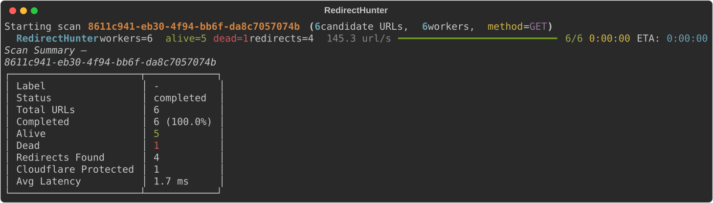
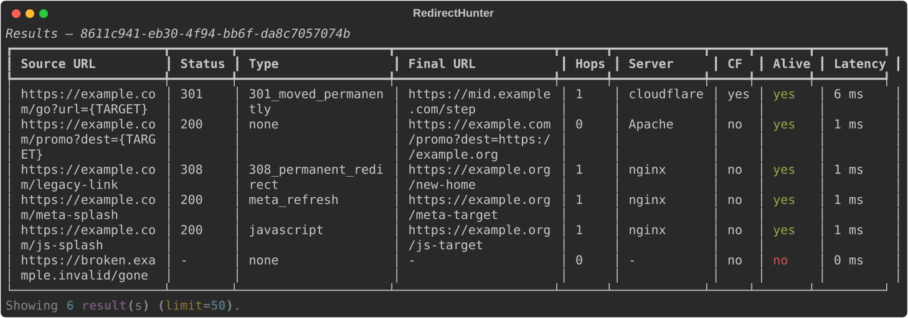
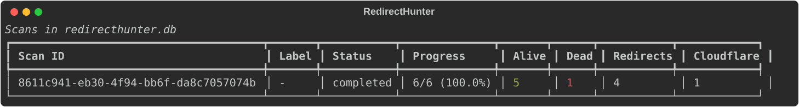

# RedirectHunter

**An HTTP Redirect Discovery and Validation Framework** for security
auditing, QA, SEO research, redirect inventory, and migration validation.

RedirectHunter is **not** an exploitation tool. It validates redirect
behavior on candidate URLs you already have — checking where they go,
what type of redirect they use, and what's serving the destination. It
never attempts to bypass any protection it encounters (Cloudflare
challenges included) — it only classifies and reports.

Use it to:

- Audit a list of known/legacy redirect endpoints during a **security
  review** of your own infrastructure
- Verify open-redirect parameters point where they're supposed to, as
  part of **authorized penetration testing**
- Validate a **site migration** actually 301s every old URL to the
  correct new one
- Build a **redirect inventory** across a large domain
- Check **SEO** redirect chains for excessive hop counts or unexpected
  final destinations

---

## Screenshots

Real output from an actual scan (captured via Rich's SVG export — not
mockups; see [`docs/generate_screenshots.py`](docs/generate_screenshots.py)):

**Scan progress and summary**



**Individual results**



**Scan history**



---

## Features

- **Four redirect-detection strategies**, run in priority order: HTTP
  status codes (301/302/303/307/308) + `Location` header, `<meta
  http-equiv="refresh">`, and static inline JavaScript pattern matching
  (`window.location`, `location.href`, `.assign()`, `.replace()`).
- **Cloudflare-aware, never Cloudflare-bypassing.** Detects `cf-ray`,
  `cf-cache-status`, `cf_clearance` cookies, `/cdn-cgi/` paths, and
  challenge-page markers — and only ever *flags* protected targets.
- **Server/CDN fingerprinting**: nginx, Apache, LiteSpeed, IIS, Cloudflare,
  CloudFront, Fastly, Varnish, Akamai.
- **Four input formats**: TXT, CSV, JSON, SQLite — with a `{TARGET}`
  templating system for testing the same set of redirect parameters
  against different destinations.
- **Async engine built for scale**: a shared, connection-pooled HTTP/2
  client, a bounded worker pool (tested up to 500 concurrent workers),
  retry-with-exponential-backoff, and an aggregate rate limiter — all
  designed to stay memory-bounded scanning 100k+ URLs.
- **Resumable scans**: every scan's exact configuration is snapshotted to
  SQLite; `redirecthunter resume` picks up exactly where an interrupted
  run left off.
- **Short scan IDs everywhere**: every command accepts an unambiguous
  prefix of a scan_id (like a git short hash), not just the full UUID.
- **`redirecthunter find`**: filter results to redirects landing outside
  a given domain — the core open-redirect audit question — and optionally
  save the result as a plain link list, one URL per line.
- **Streaming exports** to CSV, JSON, or a standalone SQLite file — none
  of them buffer a full result set in memory.
- **Live Rich progress**: worker count, throughput, success/failure
  counts, and ETA, updated in real time.

## Architecture at a glance

```
input file (.txt/.csv/.json/.db)
        │
        ▼
   loader.py  ──▶  engine.py  ──▶  analyzer.py  ──▶  detector.py + plugins/
   (candidates)    (HTTP, retry,    (response ->        (redirect-type
                    rate limit,      RedirectResult)      detection pipeline
                    worker pool)                          + Cloudflare
        │                │                                classification)
        │                ▼
        │          database.py (SQLite: scan / results / chain / headers)
        │                │
        └──────────▶ cli.py (Typer + Rich)  ──▶  exporter.py (CSV/JSON/SQLite)
```

Full design rationale — including the redirect-chain semantics
(`hop_count`, what `status_code` vs. `final_url` actually describe, why
the worker pool is structured the way it is) — is in
[`docs/ARCHITECTURE.md`](docs/ARCHITECTURE.md).

---

## Installation

Requires **Python 3.12+**.

```bash
git clone https://github.com/lanangX/redirecthunter.git
cd redirecthunter
python3 -m venv .venv
source .venv/bin/activate          # Windows: .venv\Scripts\activate
pip install -r requirements.txt
pip install -e .
```

Or install the runtime dependencies directly:

```bash
pip install -r requirements.txt
```

Verify the install:

```bash
redirecthunter --help
```

### Optional: faster event loop

On Linux/macOS, install the `speed` extra for `uvloop`:

```bash
pip install -e ".[speed]"
```

### Development install

```bash
pip install -e ".[dev]"
pytest                              # 148 tests
ruff check redirecthunter/ tests/   # lint
```

---

## Quickstart

```bash
# 1. Point it at a candidate URL list and a target to test against
redirecthunter scan examples/urls.txt --target https://example.org --method GET

# 2. Check what it found
redirecthunter stats <scan_id>
redirecthunter show <scan_id> --redirects-only

# 3. Export for further analysis
redirecthunter export <scan_id> results.csv
```

`{TARGET}` in any candidate URL (`https://a.com/go?url={TARGET}`) is
replaced with the value passed via `--target` before the request is made.
URLs without the placeholder are requested exactly as written.

---

## CLI reference

Five commands: `scan`, `resume`, `stats`, `export`, `show`. Full flag-by-flag
reference (generated from real `--help` output): [`docs/CLI_REFERENCE.md`](docs/CLI_REFERENCE.md).

```bash
# Basic scan
redirecthunter scan urls.txt

# With a target and higher concurrency
redirecthunter scan urls.txt --target https://example.org --workers 500

# GET is required to catch meta-refresh / JS redirects (HEAD has no body)
redirecthunter scan urls.txt --method GET

# Through a SOCKS5 proxy
redirecthunter scan urls.txt --proxy socks5://127.0.0.1:1080

# Rate-limited, respectful scanning of third-party infrastructure
redirecthunter scan urls.txt --rate-limit 10

# Resume an interrupted scan
redirecthunter resume <scan_id>

# Find redirects landing outside the target domain, save as a plain link list
redirecthunter find <scan_id> --output external_redirects.txt

# Every command accepts a short scan_id prefix, not just the full UUID
redirecthunter show 3f9a1c2e --redirects-only

# Everything recorded across all scans in a database
redirecthunter stats

# Only Cloudflare-protected results
redirecthunter show <scan_id> --cloudflare-only

# Export formats
redirecthunter export <scan_id> results.csv
redirecthunter export <scan_id> results.json --format json
redirecthunter export <scan_id> results.db  --format sqlite
```

---

## Input formats

| Format | Example | Notes |
|---|---|---|
| TXT | [`examples/urls.txt`](examples/urls.txt) | One URL per line, `#` comments supported. |
| CSV | [`examples/urls.csv`](examples/urls.csv) | Header row names the URL column (`--input-column`); other columns kept as metadata. |
| JSON | [`examples/urls.json`](examples/urls.json) | Array of strings and/or `{"url": "...", ...}` objects. |
| SQLite | [`examples/urls.db`](examples/urls.db) | `--input-table` / `--input-column` (defaults: `urls` / `url`). |

See [`examples/README.md`](examples/README.md) for a full walkthrough of
each format.

## Configuration file

Any flag can also be set in a YAML file, layered as: **CLI flags > YAML
file > built-in defaults**. See the fully-annotated
[`examples/redirecthunter.yaml`](examples/redirecthunter.yaml):

```yaml
target: https://example.org
method: GET
workers: 300
timeout: 8
rate_limit: null
extra_headers:
  X-Scan-Purpose: "authorized-security-audit"
```

```bash
redirecthunter scan urls.txt --config redirecthunter.yaml
# or drop it in your working directory as `redirecthunter.yaml` for auto-discovery
```

---

## Understanding the results

The single most important thing to know: **`redirect_chain` contains only
the redirects actually followed, not the terminal response.** So for a
URL that 301s once and lands on a 200:

- `status_code` / `redirect_type` / `location` describe the **first**
  response (does this URL redirect, and to what?)
- `final_url` / `server` / `fingerprint` describe the **terminal**
  response (where did it actually end up, and what's serving it?)
- `hop_count` is `1` — the number of redirects, not the number of HTTP
  requests made

Full field-by-field reference: [`docs/DATABASE_SCHEMA.md`](docs/DATABASE_SCHEMA.md).

---

## Performance

The engine is built around a single shared, connection-pooled
`httpx.AsyncClient` and a bounded `asyncio.Queue` producer/consumer pool —
not one client per worker and not a list of 100k pre-materialized tasks.
Verified in testing:

- Rate limiter correctly paces aggregate throughput regardless of worker
  count (`--rate-limit 3` measurably takes ~1.75s for 6 requests vs.
  ~0.04s unlimited).
- Retry-with-backoff recovers from transient connection failures on the
  expected schedule.
- GET response bodies are capped at 2MB and streamed, since redirect
  detection only ever needs the `<head>` of a page.

See [`docs/ARCHITECTURE.md#concurrency-model`](docs/ARCHITECTURE.md#concurrency-model)
for the full design rationale.

---

## Testing

148 tests, `respx`-mocked HTTP (no live network required), plus real
SQLite round-trips and full CLI workflow tests via Typer's `CliRunner`.

```bash
pytest                                          # full suite
pytest --cov=redirecthunter --cov-report=term-missing   # with coverage
ruff check redirecthunter/ tests/               # lint
```

---

## FAQ

**Is this an exploitation tool?**
No. It validates redirect behavior on URLs you supply — it doesn't
discover open-redirect endpoints for you, doesn't fuzz for
vulnerabilities, and doesn't attempt to defeat any protection (Cloudflare
challenges are classified, never bypassed). Use it against infrastructure
you own or are authorized to test.

**Why does `--method HEAD` (the default) miss meta-refresh and JavaScript
redirects?**
HEAD responses never have a body, and both detection strategies need to
inspect HTML/inline `<script>` content. Use `--method GET` when you need
full redirect-type coverage; HEAD remains the default because it's
faster and sufficient for pure HTTP-status auditing.

**How is `hop_count` different from "number of requests made"?**
`hop_count` counts redirects followed, not total HTTP requests. A direct
200 has `hop_count = 0` even though one request was made. See
[Understanding the results](#understanding-the-results) above.

**Can I point it at a SQLite input file with a different schema?**
Yes — `--input-table` and `--input-column` override the `urls`/`url`
defaults.

**Do I have to type the full scan_id UUID every time?**
No — every command accepts an unambiguous prefix, like a git short hash.
`redirecthunter stats` shows the first 8 characters in its listing for
exactly this reason; `redirecthunter show 3f9a1c2e` works directly. If a
prefix matches more than one scan, the command tells you and asks for more
characters rather than guessing.

**How do I find redirects that go somewhere unexpected (outside my target domain)?**
`redirecthunter find <scan_id>` — auto-detects the domain from the scan's
`--target`, or pass `--domain` explicitly. Add `--output file.txt` to save
a plain list of just the external destination URLs, one per line.

**Does it store full response headers for every redirect hop?**
Only for the terminal (final) response, in the `headers` table —
intermediate hops' relevant fields (status, `Location`, `Server`) are
already on the `chain` table. See
[`docs/DATABASE_SCHEMA.md`](docs/DATABASE_SCHEMA.md#headers).

**What happens if a scan is interrupted (Ctrl+C, crash, network outage)?**
The scan is marked `interrupted` (or `failed`, on an unhandled exception)
in the database, and every result already recorded stays there.
`redirecthunter resume <scan_id>` continues from exactly where it stopped.

---

## Project structure

```
redirecthunter/
├── cli.py            Typer CLI + Rich progress/tables
├── config.py          Layered YAML/CLI configuration
├── engine.py           Async worker pool, HTTP client, retries, rate limiting
├── analyzer.py           Response -> RedirectResult
├── detector.py             Redirect-detection pipeline orchestrator
├── plugins/                  http_location, meta_refresh, javascript, cloudflare
├── fingerprint.py               Server/CDN fingerprinting
├── database.py                    aiosqlite persistence
├── exporter.py                      Streaming CSV/JSON/SQLite export
├── loader.py                          TXT/CSV/JSON/SQLite input loading
├── logger.py                             Rich logging setup
├── models.py                                Pydantic data contracts
└── utils.py                                    URL/cookie/formatting helpers

tests/        148 pytest tests (respx-mocked HTTP, real SQLite, real CLI)
examples/     Sample input files (all 4 formats) + sample YAML config
docs/         Architecture, CLI reference, database schema, screenshots
```

## License

MIT — see [`LICENSE`](LICENSE).

## Contributing

Issues and pull requests welcome at
[github.com/lanangX/redirecthunter](https://github.com/lanangX/redirecthunter).
Please run `pytest` and `ruff check` before submitting.
